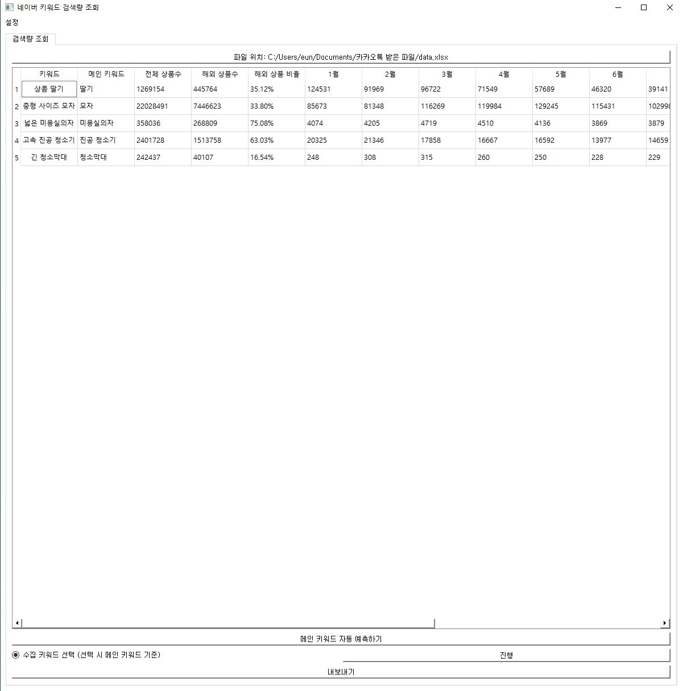
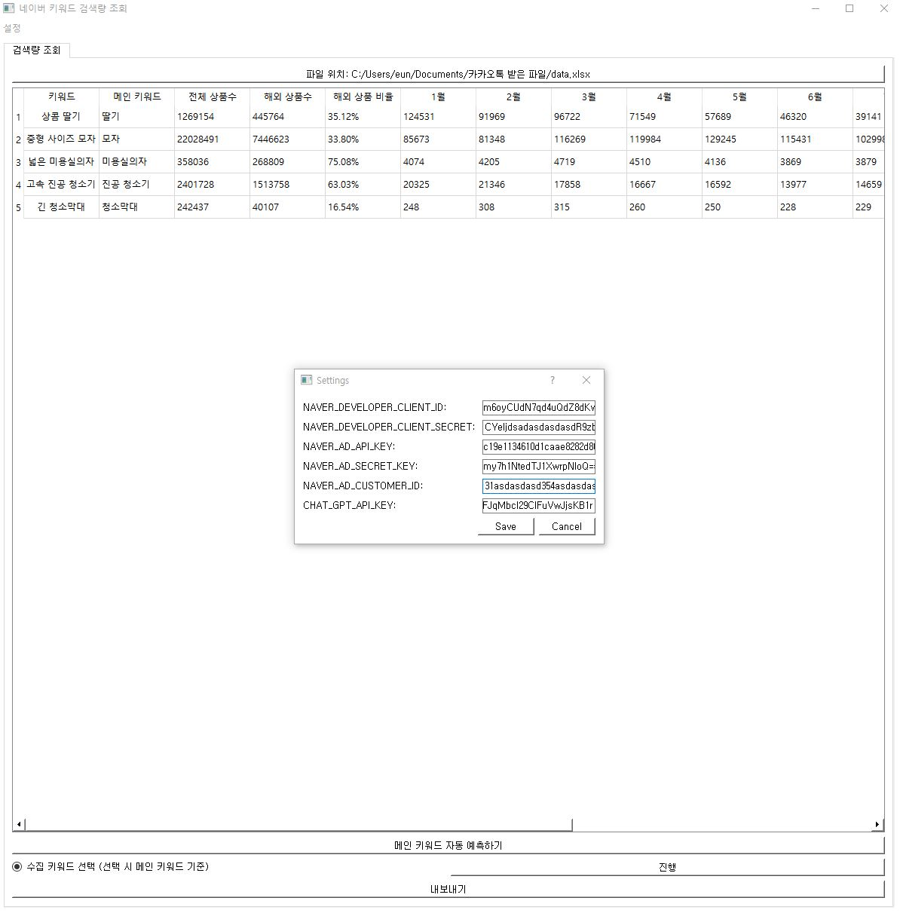
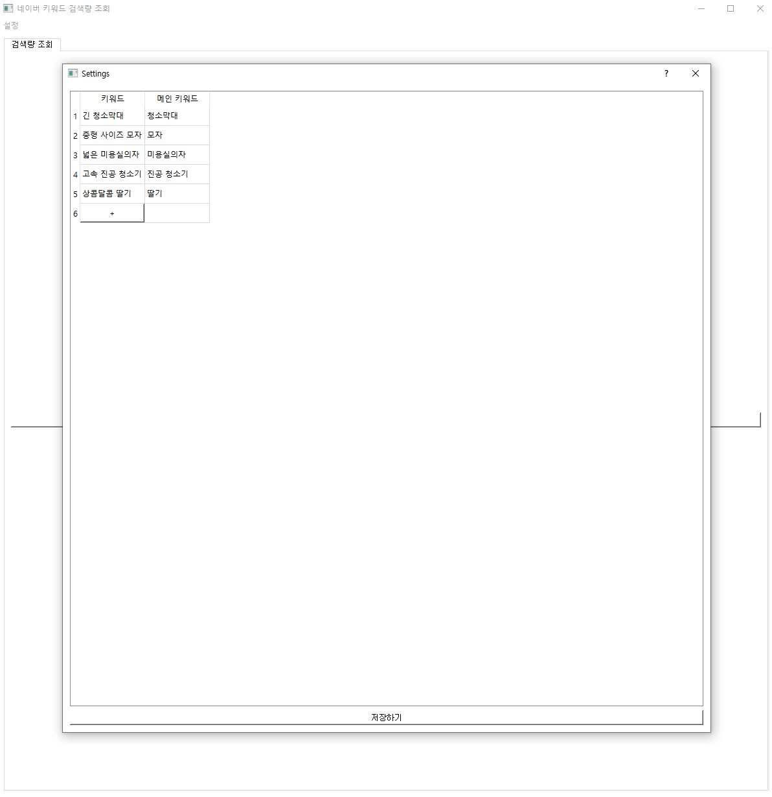

# NAVER SEAERCH VOLUME

Update excel monthly search volume by keyword using Python

# Description

When you upload an Excel file containing keywords, the main keyword is automatically tracked and the number of monthly searches for each keyword is tracked.

## Installation or Running

```bash
dist/run.exe
```

## Demo
### Version 1


### Version 2





<!--  -->


## Tech Stack

**language:**: Python

**packages:** PyQt5, openpyxl, gspread, pyinstaller, openai


## License

[MIT](https://choosealicense.com/licenses/mit/)


## Authors

- [@eun-dev](https://github.com/eun-dev)
